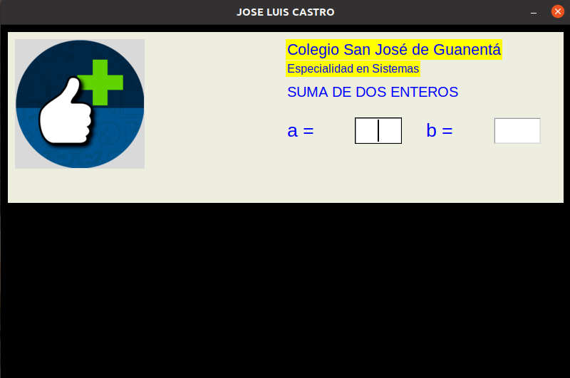
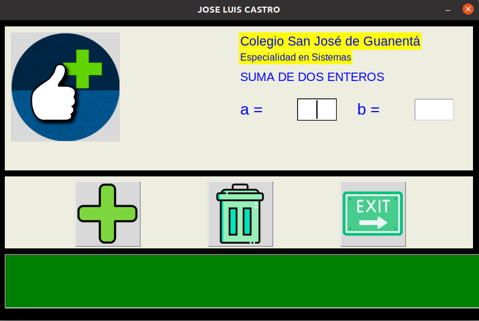

# ejercicios_Tkinter

# GUI 1: app para sumar dos numeros 

## Ventana princpal y frame entrada datos

  "Ventana principal y frame entrada"

## frame operaciones (botones)

"ventana principal y frame operaciones"

## frame resultados

 "Ventana principal y frame entrada"
