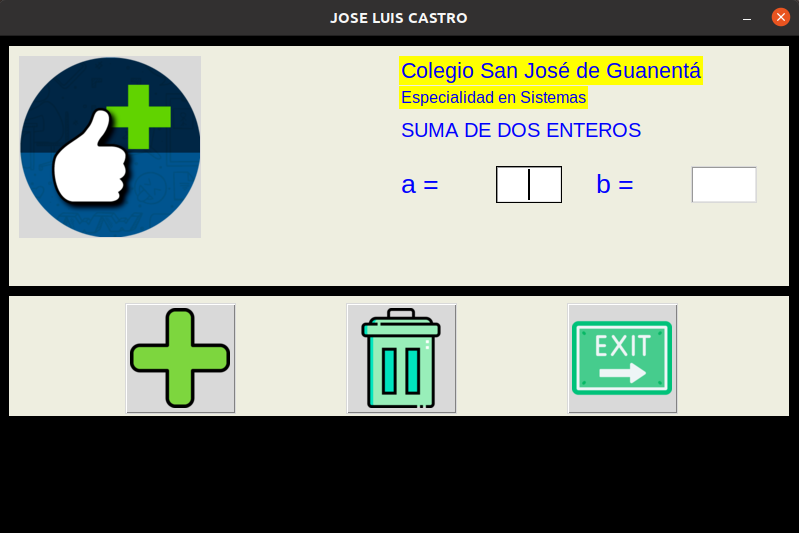

# ejercicios_Tkinter

# GUI 1: app para sumar dos numeros 

## Ventana princpal y frame entrada datos

! [ventana principal y frame entrada](ventana principal.png) "Ventana princcipal y frame entrada"

## frame operaciones (botones)

"frame operaciones (Botones)"